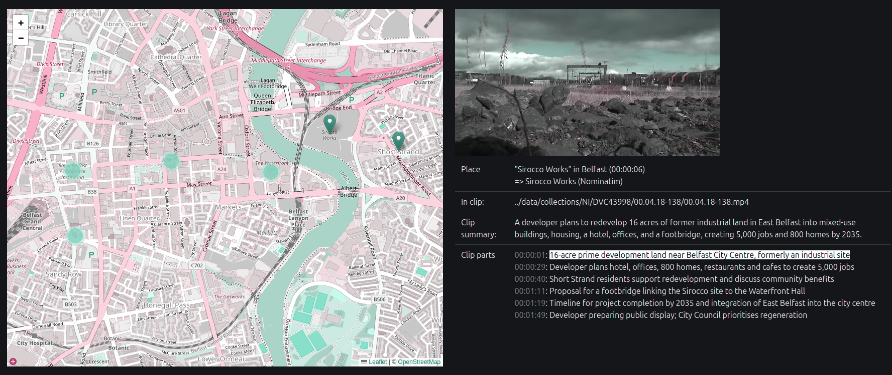
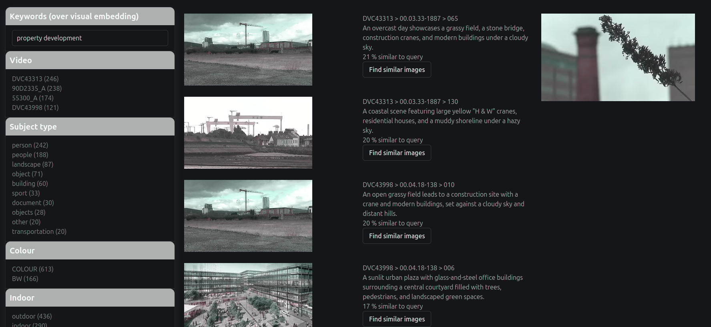

# Geo Search Prototype (MVP 2)

## Pre-processing

Pre-requisite: Python 3.10+ must be installed on the machine. 

### With FrameSense

We use a separate tool called 
[FrameSense](https://github.com/kingsdigitallab/framesense) 
to extract data from a collection of video files.

TODO: explain how to set up FS, the input videos and process them.

### Indexing

Each user interface has its own data index. 
They can be rebuilt from the FrameSense output with the following python scripts.

#### Indexing for the Map Search

This command will build a json index of all the enunciated place names FrameSense has extracted from the transcription of the videos.
Each place name is geolocated using the free Nominatim service. 
The command also builds a cache of Nominatim responses to speed up the process and reduce load on their server.

```bash
cd tools
python3 index_place.py
```

#### Indexing for the Semantic Search

This command will build a json index of the middle frame of every shot in the input videos.
For each frames there is a caption, a visual embedding, topical tags (free and controlled), and visual categories.
All of which have been extracted by FrameSense using a vision language model on the frame.

```bash
cd tools
python3 index_shots.py
```

## User interfaces

Pre-requisite: [npm must be installed on your machine](https://docs.npmjs.com/downloading-and-installing-node-js-and-npm).

Install javascript libraries: `npm ci`

Run the local web server: `npm run serve`

Please use **Firefox** to access the user interfaces as the interaction with the video player is buggy on Chrome based browsers.

### Map search over spoken place names

http://localhost:8090/places.html

This interface displays all place names (with identifiable geo-coordinates) mentioned in the videos.

Hover the markers on the map to watch where the corresponding place name was ennunciated in a video.

A hover will load the video around the moment the name is spoken. 
It will also display a summary of the video clip and its topical parts extracted by a LLM fom the clip transcriptions.
Hovering the time code of a part will load that moment in the video player. A click will start playing the video.



### Semantic Search over keyframes

http://localhost:8090/shots.html

Use this search interface to filter all shots in the prototype collection by:
* a user query
* a facet option

Shots are represented by their middle frame.
A user query will match exactly keywords found in the frame caption generated by a VLM.
If an embedding server is running, the query will instead match frames with similar visual embedding (i.e. semantic search).



How to run the embedding server for a collection?

`python3 framesense.py embed_frames_transformers -s NI`

Where NI is the name of the video collection.
