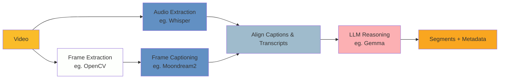

# Semantic Segmentation

Semantic segmentation of videos using machine learning methods to automatically
identify content boundaries and extract metadata.

## Overview

This prototype provides tools for analyzing video files and breaking them into
meaningful segments with descriptive metadata. The primary use case is processing
archived broadcast content (news, documentaries, interviews) where manual
segmentation would be time-intensive.

**Output Format:**

```json
{
  "startTime": "00:00:00",
  "endTime": "00:00:10",
  "summary": "Detailed description of segment content"
}
```

## Approaches

### Frame Caption Pipeline

Uses generative vision-language models to create frame descriptions, and speech
recognition to extract speech, then applies LLM reasoning for segmentation. This
approach focuses on small language models that can be run locally and without the
need for intensive resources.

#### Components



#### Pipeline Steps

- Frame Extraction: Samples frames at 0.5-1 FPS (adjustable) using OpenCV
  - Could also use `framesense` to pickup shots in a first step to reduce the number of frames
- Visual Analysis: Moondream2 generates detailed natural language descriptions of each frame
- Audio Transcription: Whisper extracts speech with timestamps
- Alignment: Aligns frame captions and audio transcripts to ensure accurate timing
- Semantic Segmentation: LLM analyzes the frame captions + audio data to identify segment boundaries and generate summaries
  1. Detect boundaries between the segments, by looking at changes in the captions and transcriptions
  1.

## Other Approaches

- Frame classification pipeline (faster but less detailed)
- Scene detection + boundary refinement
- Audio-only segmentation
- Hybrid methods

## Dependencies

- Python 3.11+
- [uv](https://docs.astral.sh/uv/) - Fast Python package manager
- ffmpeg (required by Whisper for audio processing)
- Hugging Face account and token (for downloading models)

## Getting Started

### 1. Install uv

```bash
# macOS/Linux
curl -LsSf https://astral.sh/uv/install.sh | sh

# Or with brew
brew install uv
```

### 2. Clone and Setup

```bash
cd etl
# Install all dependencies
uv sync
```

### 3. Configure Hugging Face

```bash
# Login to Hugging Face (required for model downloads)
uv run hf auth login
```

Enter your Hugging Face token when prompted.

### 4. Install ffmpeg

```bash
# macOS
brew install ffmpeg

# Ubuntu/Debian
sudo apt install ffmpeg

# Check installation
ffmpeg -version
```

## Usage

The pipeline consists of 4 steps that must be run in order:

### Step 1: Extract Frames

```bash
uv run python main.py extract-frames path/to/video.mp4 \
    --sample-rate 1.0 \
    --output-folder ../data/1_interim
```

**Options:**

- `--sample-rate`: Frames per second to extract (default: 1.0)
- `--output-folder`: Where to save extracted frames

### Step 2: Extract Audio & Transcribe

```bash
uv run python main.py extract-audio path/to/video.mp4 \
    --language en \
    --model-size small \
    --output-folder ../data/1_interim
```

**Options:**

- `--language`: Audio language code (default: "en")
- `--model-size`: Whisper model size: tiny, base, small, medium, large (default: "small")
- `--output-folder`: Where to save transcription

### Step 3: Caption Frames

```bash
uv run python main.py caption-frames path/to/video.mp4 \
    --model-name vikhyatk/moondream2 \
    --remove-duplicates \
    --output-folder ../data/1_interim
```

**Options:**

- `--model-name`: Vision model from Hugging Face (default: "vikhyatk/moondream2")
- `--remove-duplicates`: Remove consecutive duplicate captions (default: True)
- `--output-folder`: Where to save captions

### Step 4: Align Captions and Audio

```bash
uv run python main.py align path/to/video.mp4 \
    --input-folder ../data/1_interim \
    --merge-duplicates \
    --output-folder ../data/1_interim
```

**Options:**

- `--input-folder`: Folder with transcription and captions from previous steps
- `--merge-duplicates`: Merge consecutive duplicate transcriptions (default: True)
- `--output-folder`: Where to save aligned captions

### Step 5: Generate Segments

#### Step 5.1: Detect Boundaries

```bash
uv run python main.py detect-boundaries path/to/video.mp4 \
    --model-name google/gemma-3-4b-it \
    --input-folder ../data/1_interim \
    --prompt-path ../data/0_prompts/segmentation.md \
    --output-folder ../data/2_final
```

**Options:**

- `--model-name`: LLM model for segmentation (default: "google/gemma-3-4b-it")
- `--input-folder`: Folder with transcription and captions from previous steps
- `--prompt-path`: Custom system prompt for the LLM
- `--output-folder`: Where to save segments with boundary data

#### Step 5.2: Merge Segments

```bash
uv run python main.py merge-segments path/to/video.mp4 \
    --input-folder ../data/1_interim \
    --output-folder ../data/2_final
```

**Options:**

- `--input-folder`: Folder with the boundaries from previous step
- `--output-folder`: Where to save merged segments

#### Step 5.3: Summarise Segments

```bash
uv run python main.py summarise-segment path/to/video.mp4 \
    --model-name google/gemma-3-4b-it \
    --input-folder ../data/1_interim \
    --prompt-path ../data/0_prompts/segmentation.md \
    --output-folder ../data/2_final
```

**Options:**

- `--model-name`: LLM model for segmentation (default: "google/gemma-3-4b-it")
- `--input-folder`: Folder with merged segments from previous step
- `--prompt-path`: Custom system prompt for the LLM
- `--output-folder`: Where to save segments with summaries

#### Step 5.4: Classify Segments

```bash
uv run python main.py classify-segment path/to/video.mp4 \
    --model-name google/gemma-3-4b-it \
    --input-folder ../data/1_interim \
    --prompt-path ../data/0_prompts/segmentation.md \
    --output-folder ../data/2_final
```

**Options:**

- `--model-name`: LLM model for classification (default: "google/gemma-3-4b-it")
- `--input-folder`: Folder with segments with summaries from previous step
- `--prompt-path`: Custom system prompt for the LLM
- `--output-folder`: Where to save segments with topics and metadata

### Complete Pipeline Example

```bash
VIDEO="path/to/broadcast.mp4"

# Run all steps in sequence
uv run python main.py extract-frames "$VIDEO"
uv run python main.py extract-audio "$VIDEO"
uv run python main.py caption-frames "$VIDEO"
uv run python main.py align-data "$VIDEO"
uv run python main.py detect-boundaries "$VIDEO"
uv run python main.py merge-segments "$VIDEO"
uv run python main.py summarise-segments "$VIDEO"
uv run python main.py classify-segments "$VIDEO"
```

## Evaluation

To visually inspect and verify the generated segments, you can use the provided
`evaluation.html` tool.

### How to Use

1.  Open the `evaluation.html` file in a web browser.
2.  Click "Load video" and select the video file you processed.
3.  Click "Load segment data" and select the `classifications.json` file
    generated by the pipeline (located in `data/2_final/your_video_name/`).

The interface will display the video and a list of segment cards. As the video plays, the corresponding segment card will be highlighted. You can also click the "Jump to" button on any card to navigate the video to that segment's start time.

## Output Structure

```
data/
├── 1_interim/
│   └── video.mp4/
│       ├── frames/              # Extracted frame images
│       ├── captions.json        # Frame captions with timestamps
│       └── transcription.json   # Audio transcription with timestamps
└── 2_final/
    └── video.mp4/
        ├── segments.json        # Final semantic segments
        ├── segments.txt         # Raw LLM output
        └── prompt.json          # Prompt sent to LLM
```

## Development

### Running Tests

```bash
uv run pytest
```

### Code Formatting

```bash
uv run ruff check .
uv run ruff format .
```

## Troubleshooting

### ModuleNotFoundError: No module named 'components'

- Ensure you're running commands with `uv run` from the `etl/` directory
- Check that `pyproject.toml` has the correct configuration

### CUDA/MPS not detected

- Ensure PyTorch is installed with GPU support
- Check device availability: `python -c "import torch; print(torch.cuda.is_available())"`

### Whisper transcription fails

- Verify ffmpeg is installed and accessible: `ffmpeg -version`
- Check audio track exists in video: `ffmpeg -i video.mp4`

### Out of memory errors

- Reduce sample rate: `--sample-rate 0.5`
- Use smaller models: `--model-size tiny` for Whisper
- Process shorter video clips first

## Results

### 13 Nov 2025

- A small modle like Gemma 3 is not very good at semantically segmenting the video, it
  returns a lot of false positives.
  - Processing time for 50 frames: 2m.
- On the other hand, the exact same prompt on Gemini Pro and Qwen 3 20B provide quite good results.
