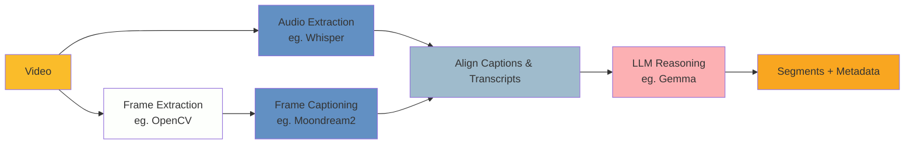

# Semantic Segmentation

Semantic segmentation of videos using machine learning methods to automatically
identify content boundaries and extract metadata.

## Overview

This prototype provides tools for analyzing video files and breaking them into
meaningful segments with descriptive metadata. The primary use case is processing
archived broadcast content (news, documentaries, interviews) where manual
segmentation would be time-intensive.

**Output Format:**

```json
{
  "startTime": "00:00:00",
  "endTime": "00:00:10",
  "summary": "Detailed description of segment content"
}
```

## Approaches

### Frame Caption Pipeline

Uses generative vision-language models to create frame descriptions, and speech
recognition to extract speech, then applies LLM reasoning for segmentation. This
approach focuses on small language models that can be run locally and without the
need for intensive resources.

#### Components



#### Pipeline Steps

- Frame Extraction: Samples frames at 0.5-1 FPS (adjustable) using OpenCV
  - Could also use `framesense` to pickup shots in a first step to reduce the number of frames
- Visual Analysis: Moondream2 generates detailed natural language descriptions of each frame
- Audio Transcription: Whisper extracts speech with timestamps
- Alignment: Aligns frame captions and audio transcripts to ensure accurate timing
- Semantic Segmentation: LLM analyzes the frame captions + audio data to identify segment boundaries and generate summaries
  1. Detect boundaries between the segments, by looking at changes in the captions and transcriptions
  1.

## Other Approaches

- Frame classification pipeline (faster but less detailed)
- Scene detection + boundary refinement
- Audio-only segmentation
- Hybrid methods

## Dependencies

- Python 3.11+
- [uv](https://docs.astral.sh/uv/) - Fast Python package manager
- ffmpeg (required by Whisper for audio processing)
- Hugging Face account and token (for downloading local models)
- OpenAI-compatible API key (optional, for using API backend)

## Configuration

For API usage, create a `.env` file in the `etl/` directory or set environment variables:

```bash
# Required for API backend
API_KEY=your_api_key_here

# Optional: Override default OpenAI URL (e.g. for local LLMs via Ollama/vLLM)
API_BASE_URL=https://api.openai.com/v1
```

## Getting Started

### 1. Install uv

```bash
# macOS/Linux
curl -LsSf https://astral.sh/uv/install.sh | sh

# Or with brew
brew install uv
```

### 2. Clone and Setup

```bash
cd etl
# Install all dependencies
uv sync
```

### 3. Configure Hugging Face

```bash
# Login to Hugging Face (required for model downloads)
uv run hf auth login
```

Enter your Hugging Face token when prompted.

### 4. Install ffmpeg

```bash
# macOS
brew install ffmpeg

# Ubuntu/Debian
sudo apt install ffmpeg

# Check installation
ffmpeg -version
```

## Usage

The pipeline consists of 4 steps that must be run in order:

### Step 1: Extract Frames

```bash
uv run python main.py extract-frames path/to/video.mp4 \
    --sample-rate 1.0 \
    --output-folder ../data/1_interim
```

**Options:**

- `--sample-rate`: Frames per second to extract (default: 1.0)
- `--output-folder`: Where to save extracted frames

### Step 2: Extract Audio & Transcribe

```bash
uv run python main.py extract-audio path/to/video.mp4 \
    --language en \
    --model-size small \
    --output-folder ../data/1_interim
```

**Options:**

- `--language`: Audio language code (default: "en")
- `--model-size`: Whisper model size: tiny, base, small, medium, large (default: "small")
- `--output-folder`: Where to save transcription

### Step 3: Caption Frames

```bash
uv run python main.py caption-frames path/to/video.mp4 \
    --model-name vikhyatk/moondream2 \
    --remove-duplicates \
    --output-folder ../data/1_interim
```

**Options:**

- `--model-name`: Vision model to use. For local: "vikhyatk/moondream2" (default). For API: e.g. "gpt-4o", "gemini-pro-vision".
- `--remove-duplicates`: Remove consecutive duplicate captions (default: True)
- `--output-folder`: Where to save captions
- `--backend`: "local" (default) or "api"

**Example (API):**

```bash
uv run python main.py caption-frames path/to/video.mp4 \
    --backend api \
    --model-name gpt-4o
```

### Step 4: Align Captions and Audio

```bash
uv run python main.py align path/to/video.mp4 \
    --input-folder ../data/1_interim \
    --merge-duplicates \
    --output-folder ../data/1_interim
```

**Options:**

- `--input-folder`: Folder with transcription and captions from previous steps
- `--merge-duplicates`: Merge consecutive duplicate transcriptions (default: True). Use `--no-merge-duplicates` to disable.
- `--output-folder`: Where to save aligned captions

### Step 5: Generate Segments

#### Step 5.1: Detect Boundaries

```bash
uv run python main.py detect-boundaries path/to/video.mp4 \
    --model-name google/gemma-3-4b-it \
    --input-folder ../data/1_interim \
    --prompt-path ../data/0_prompts/segmentation.md \
    --output-folder ../data/2_final
```

**Options:**

- `--model-name`: LLM model for segmentation (default: "google/gemma-3-4b-it"). For API: e.g. "gpt-4o".
- `--input-folder`: Folder with transcription and captions from previous steps
- `--prompt-path`: Custom system prompt for the LLM
- `--output-folder`: Where to save segments with boundary data
- `--backend`: "local" (default) or "api"

#### Step 5.2: Merge Segments

```bash
uv run python main.py merge-segments path/to/video.mp4 \
    --input-folder ../data/1_interim \
    --output-folder ../data/2_final
```

**Options:**

- `--input-folder`: Folder with the boundaries from previous step
- `--output-folder`: Where to save merged segments

#### Step 5.3: Summarise Segments

```bash
uv run python main.py summarise-segments path/to/video.mp4 \
    --model-name google/gemma-3-4b-it \
    --caption-chunk-size 25 \
    --input-folder ../data/1_interim \
    --prompt-path ../data/0_prompts/segmentation.md \
    --output-folder ../data/2_final
```

**Options:**

- `--model-name`: LLM model for segmentation (default: "google/gemma-3-4b-it"). For API: e.g. "gpt-4o".
- `--caption-chunk-size`: Number of captions to include in each chunk (default: 25)
- `--input-folder`: Folder with merged segments from previous step
- `--prompt-path`: Custom system prompt for the LLM
- `--output-folder`: Where to save segments with summaries
- `--backend`: "local" (default) or "api"

#### Step 5.4: Classify Segments

```bash
uv run python main.py classify-segment path/to/video.mp4 \
    --model-name google/gemma-3-4b-it \
    --input-folder ../data/1_interim \
    --prompt-path ../data/0_prompts/segmentation.md \
    --output-folder ../data/2_final
```

**Options:**

- `--model-name`: LLM model for classification (default: "google/gemma-3-4b-it"). For API: e.g. "gpt-4o".
- `--input-folder`: Folder with segments with summaries from previous step
- `--prompt-path`: Custom system prompt for the LLM
- `--output-folder`: Where to save segments with topics and metadata
- `--backend`: "local" (default) or "api"

### Step 6: Aggregate Metadata

Collects auditing metadata from all processing steps into a single file.

```bash
uv run python main.py aggregate-metadata path/to/video.mp4 \
    --interim-folder ../data/1_interim \
    --final-folder ../data/2_final \
    --output-folder ../data/2_final
```

**Options:**

- `--interim-folder`: Folder with intermediate outputs (default: "../data/1_interim")
- `--final-folder`: Folder with final outputs (default: "../data/2_final")
- `--output-folder`: Where to save metadata.json

### Complete Pipeline Example

```bash
VIDEO="path/to/broadcast.mp4"

# Run all steps in sequence
uv run python main.py extract-frames "$VIDEO"
uv run python main.py extract-audio "$VIDEO"
uv run python main.py caption-frames "$VIDEO"
uv run python main.py align "$VIDEO"
uv run python main.py detect-boundaries "$VIDEO"
uv run python main.py merge-segments "$VIDEO"
uv run python main.py summarise-segments "$VIDEO"
uv run python main.py classify-segments "$VIDEO"
uv run python main.py aggregate-metadata "$VIDEO"
```

## Evaluation

The `evaluation.html` tool provides a visual interface for inspecting and verifying generated segments. It displays the video alongside segment cards showing timestamps, summaries, and metadata. As the video plays, the current segment is highlighted and auto-scrolled into view. Clicking any timestamp jumps the video to that position.

To use it, open the file in a browser, load your video file and the corresponding `classifications.json` from `data/2_final/`. The tool works entirely offline and requires no server.

## Output Structure

```
data/
├── 1_interim/
│   └── video.mp4/
│       ├── frames/              # Extracted frame images
│       ├── captions.json        # Frame captions with timestamps
│       ├── transcription.json   # Audio transcription with timestamps
│       └── aligned_data.json    # Aligned captions and transcriptions
└── 2_final/
    └── video.mp4/
        ├── boundaries.json      # Segments with boundary detection
        ├── merged_segments.json # Merged segments
        ├── summaries.json       # Segments with summaries
        ├── classifications.json # Final segments with topics
        └── metadata.json        # Aggregated processing metadata
```

### Output File Format

All JSON output files include auditing metadata:

```json
{
    "_meta": {
        "component": "frame_captioning",
        "processed_at": "2025-12-10T19:38:03+08:00",
        "processing_time_seconds": 125.34,
        "backend": "local",
        "model_name": "vikhyatk/moondream2",
        "device": "cuda",
        "input_file": "video.mp4",
        "input_file_size_bytes": 524288000,
        "items_processed": 150,
        "api_calls": 0,
        "parameters": { "remove_duplicates": true },
        "package_version": "0.1.0",
        "git_hash": "a3f7b2c",
        "python_version": "3.11.5",
"platform": "Linux-6.8.0-85-generic-x86_64-with-glibc2.39",
        "hostname": "ml"
    },
    "data": [ ... ]
}
```

## Development

### Running Tests

```bash
uv run pytest
```

### Code Formatting

```bash
uv run ruff check .
uv run ruff format .
```

## Troubleshooting

### ModuleNotFoundError: No module named 'components'

- Ensure you're running commands with `uv run` from the `etl/` directory
- Check that `pyproject.toml` has the correct configuration

### CUDA/MPS not detected

- Ensure PyTorch is installed with GPU support
- Check device availability: `python -c "import torch; print(torch.cuda.is_available())"`

### Whisper transcription fails

- Verify ffmpeg is installed and accessible: `ffmpeg -version`
- Check audio track exists in video: `ffmpeg -i video.mp4`

### Out of memory errors

- Reduce sample rate: `--sample-rate 0.5`
- Use smaller models: `--model-size tiny` for Whisper
- Process shorter video clips first

## Results

### 26 Nov 2025

- **Added Boundary Detection**: Implemented a sliding window approach (Previous, Current, Next) which significantly reduces fragmentation and improves context awareness compared to the pairwise comparison.
- **Metadata Extraction**: The pipeline now automatically generates:
    - **Summaries**:  Descriptions of segment content, but they need improvement because at the moment it is more of a visual description than a content description.
    - **Classifications**: Structured fields including Topic, Channel, Program Name, and Transmission Date.
- **Verification Tooling**: Added `evaluation.html`, a standalone dashboard to visualize segments, play the corresponding video ranges, and verify metadata accuracy in real-time.

#### Processing time for a 30m video on an RTX 4090/24GB.

| Step | Items | Time (m) |
| --- | --- | --- |
| Extracting frames | 2102 | 01 |
| Transcribing audio | 1 | 04 |
| Captioning frames | 2102 | 55 |
| Aligning frames with transcriptions | 2084 | 00 |
| Detecting boundaries | 2084 | 10 |
| Merging segments | 60 | 00 |
| Summarising segments | 60 | 7 |
| Classifying segments | 60 | 3 |
| Total | - | ~120m  |

### 13 Nov 2025

- A small model like Gemma 3 is not very good at semantically segmenting the video, it
  returns a lot of false positives.
  - Processing time for 50 frames: 2m.
- On the other hand, the exact same prompt on Gemini Pro and Qwen 3 20B provide quite good results.
