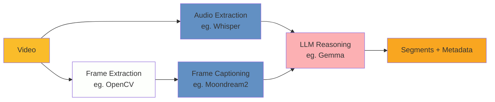

# Semantic Segmentation

Semantic segmentation of videos using machine learning methods to automatically
identify content boundaries and extract metadata.

## Overview

This prototype provides tools for analyzing video files and breaking them into
meaningful segments with descriptive metadata. The primary use case is processing
archived broadcast content (news, documentaries, interviews) where manual
segmentation would be time-intensive.

**Output Format:**

```json
{
  "startTime": "00:00:00",
  "endTime": "00:00:10",
  "summary": "Detailed description of segment content"
}
```

## Approaches

### Frame Caption Pipeline

Uses generative vision-language models to create frame descriptions, and speech
recognition to extract speech, then applies LLM reasoning for segmentation. This
approach focuses on small language models that can be run locally and without the
need for intensive resources.

#### Components



#### Pipeline Steps

- Frame Extraction: Samples frames at 0.5-1 FPS (adjustable) using OpenCV
- Visual Analysis: Moondream2 generates detailed natural language descriptions of each frame
- Audio Transcription: Whisper extracts speech with timestamps
- Semantic Segmentation: LLM analyzes the frame captions + audio data to identify segment boundaries and generate summaries

## Other Approaches

- Frame classification pipeline (faster but less detailed)
- Scene detection + boundary refinement
- Audio-only segmentation
- Hybrid methods
