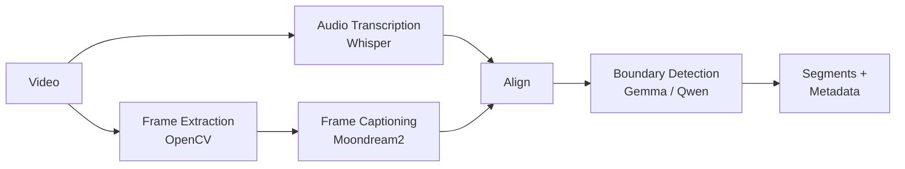

<style>
@import url('https://fonts.googleapis.com/css2?family=Outfit:wght@400;500;600&display=swap');

:root {
  --slidev-theme-primary: #0a2d50;
}

p, li, blockquote, td, th, code {
  font-family: Outfit, sans-serif;
}
</style>

<div style="position: absolute; top: 1.5rem; right: 2rem;">
  
</div>

<style scoped>
* {
  text-shadow: 2px 2px 8px rgba(0,0,0,0.8);
}
</style>

# Semantic Video Segmentation

### A Multimodal Pipeline for Broadcast Archive Description

#### Miguel Vieira · King's Digital Lab

<br />

##### ISSA — Technical Walkthrough

<!--
I'm Miguel, Principal Research Software Engineer at King's Digital Lab. This is a technical walkthrough of a multimodal pipeline I built for ISSA — automatically identifying semantic boundaries in archive broadcast video and producing structured metadata per segment.

I'll cover the full system: problem framing, architecture, model decisions and why I made them, evaluation, and what I'd do differently. I'll be specific about trade-offs. Interrupt me whenever.
-->

---

# Problem Framing

- Thousands of digitised archive tapes — no metadata, unknown contents
- Semantic segmentation: topic shifts, not camera cuts
- Zero-shot: no labelled training data exists for this corpus
- Must run on institutional hardware; data cannot leave the building

<!--
Precision matters here. This is NOT shot boundary detection. PySceneDetect finds technical cuts — it fires on every camera transition. We want semantic boundaries: where one news story ends and another begins, even if the visual style is consistent.

The no-ground-truth constraint shapes the entire evaluation story. We had nothing to train or fine-tune on, so the approach has to be zero-shot throughout.

The privacy constraint is what drove model selection. Cloud APIs were ruled out as the primary backend for most partner institutions, which pushed me toward small open-weight models — and that in turn shapes everything about capacity and accuracy.
-->

---

# Pipeline Architecture



- File-based: each step outputs JSON consumed by the next
- Resumable: re-run from any step without starting over
- Every output: `{ "_meta": { model, device, git_hash, ... }, "data": [...] }`

<!--
Why file-based and sequential rather than an in-memory graph?

Frame captioning takes ~55 minutes for a 30-minute tape. A file-based design means a failure at step 7 doesn't cost you the captioning run. You fix the issue and resume.

The JSON files are also inspectable. When something goes wrong you open the file at that step and see exactly what the model produced. That matters for debugging and for explaining outputs to non-technical stakeholders.

The _meta envelope was a deliberate choice for auditability: every output carries its own provenance — model, device, git hash, processing time. The output of any run is fully reproducible.

The diagram also shows something important: frame extraction and audio transcription are independent branches. In the current implementation they run sequentially, but there's no architectural reason they have to — that's an easy parallelism win if throughput becomes a priority.
-->

---

```yaml
layout: two-cols-header
```

# Model Choices — Vision & Audio

::left::

**Vision · Moondream2 · 1.9B**

- Fits in 8 GB VRAM; rules out larger alternatives
- Strong OCR — reads chyrons and programme names
- Two prompts: structured (local) vs. minimal (API)

::right::

**Audio · Whisper**

- Configurable size: `tiny` → `large`
- `align` merges both streams per frame timestamp
- LLM sees vision + audio together, not separately

<!--
On Moondream2: the VRAM constraint (single 8 GB GPU) ruled out most alternatives. LLaVA-34B and InternVL-26B are simply too large. Among models that fit, Moondream2 was faster than Qwen-VL at a comparable parameter count and had noticeably better OCR performance — which matters a lot here because on-screen chyrons and programme name graphics are a primary metadata source.

The two-prompt design: PROMPT_LARGE asks for structured three-section output (segment type classification, all visible text, scene description). That structure lets the downstream boundary LLM parse it reliably — it knows where to look for the chyron versus the description. PROMPT_SMALL is a single-sentence prompt for the API backend, which can produce structured output natively via JSON mode, so you don't pay for formatting tokens.

On the alignment step: without it, the boundary detector would see two streams with different time resolutions. By merging them into one record per frame, you give the model a unified view at each timestamp. That's what makes the segmentation semantic — the model can confirm topical continuity from the transcript even when the shot changes, or detect a new topic from the chyron even when the studio setting is the same.

On Whisper size: base for development, large for final runs. The accuracy difference on broadcast speech (clear, formal) is real but not dramatic. The bigger gains from large come on noisy location audio and accented speech.

One gap worth naming: Whisper doesn't diarise. In interview segments with multiple speakers, the transcript is accurate but unattributed. I'd add pyannote to handle speaker-change segmentation.
-->

---

# Boundary Detection

```
[Previous Frame Context (T-1)]
{ "caption": "...", "transcript": "...", "timestamp": ... }

[Current Frame Context (T)]
{ "caption": "...", "transcript": "...", "timestamp": ... }

[Next Frame Context (T+1)]
{ "caption": "...", "transcript": "...", "timestamp": ... }
```

- 3-frame window: T-1 for context, T+1 to confirm change persists
- Binary YES/NO — small models produce poorly calibrated scores
- Prompt lives in Markdown — domain experts can tune it without touching code
- Qwen over Gemma-3: far fewer false positives empirically

<!--
The 3-frame window is the decision I'm most confident about. Single-frame classification is blind to context — you can't tell whether a weather map is the start of a weather segment or a one-second cutaway. T-1 tells you what came before; T+1 confirms the change persists rather than the model reacting to a flicker.

The cost is N-1 LLM calls per tape. For a 35-minute tape at 1 fps that's ~2,100 calls. Boundary detection adds ~10 minutes on the RTX 4090 — significant but not the bottleneck. The optimisation I haven't implemented yet: compute caption embedding similarity first and only run the full 3-frame window call where similarity drops. That would cut the majority of calls on static content.

YES/NO is intentionally simple. I experimented with confidence scores but small models produce poorly calibrated probabilities — their 0.7 doesn't mean what you'd want it to mean. A binary output is honest.

The prompt in a Markdown file is load-bearing. The prompt is the primary tuning knob for this system. Separating it from code means a domain expert (or an archivist partner) can adjust the boundary definition without touching Python. That collaborative prompt development is likely to improve accuracy more than any technical change.

Gemma-3 vs Qwen: purely empirical. I ran both on the test tape, counted segments, and manually inspected the short ones. Gemma-3 fired on nearly every brief visual transition — slates, colour bars — producing dozens of 1–2 second segments. Qwen was more selective. I can't give you precision/recall numbers because I had no ground truth. That's the honest position.
-->

---

# Dual Backend

- `--backend local|api` per command, independently configurable
- Local: HuggingFace transformers, on-device (CUDA · MPS · CPU)
- API: any OpenAI-compatible endpoint via `.env`
- `get_model_client()` — callers never branch on backend

<!--
The design came from a real constraint: most partner institutions cannot send footage to an external API. But I didn't want to build a system that couldn't benefit from more capable models when privacy isn't a concern — for internal research or evaluation.

The abstraction layer is the key decision. Every component calls get_model_client() and generate_text_from_messages() and gets back the same interface regardless of whether it's talking to a local Moondream2 or to GPT-4V over HTTPS. That makes A/B comparisons trivial — swap the backend flag and run again, no code changes.

The MPS handling is a practical detail: Apple Silicon doesn't support float16 for all operations, so get_torch_device() falls back to float32 on MPS. One-line check, saves a confusing error for developers on Macs.

One thing I'd change: the API backend currently base64-encodes frames and embeds them in the request body. That's expensive and produces large requests. For production I'd upload frames to blob storage and pass URLs — most multimodal APIs support it and it's significantly faster and cheaper at scale.
-->

---

```yaml
layout: cover
background: ./assets/demo.png
```

<style scoped>
* {
  text-shadow: 2px 2px 8px rgba(0,0,0,0.8);
}
</style>

# Output & Interface

<!--
Static HTML verification interface — no server, no build step. Load the video and the pipeline's output folder from local disk.

Left panel: video. Right panel: 64 segments for this 35-minute UTV news broadcast. Active segment highlights as the video plays; clicking a timestamp jumps to that point.

The segment card shows start/end timestamps, boundary frames, the generated summary, and extracted metadata. Below the segment list: full processing provenance — every step, its duration, and the model used.

Point out honestly: some segments are 1–2 seconds. Those are the boundary detector reacting to brief visual changes rather than meaningful content shifts. Known limitation, I'll address it in the next slide.
-->

---

```yaml
layout: two-cols-header
```

# Results

::left::

**Documentary** · 30 min · 30 segments


::right::

**Rushes** · 23 min · 44 segments


<!--
Three content types, different failure modes.

News broadcast: the most visual noise — frequent cutaways, lower-thirds appearing and disappearing. More spurious short boundaries as a result.

Documentary: slower, more coherent content shifts. Fewer false positives. The lower visual complexity helped the vision model too.

Rushes: no voiceover, just sync sound. The boundary detector leaned more heavily on visual captions. Encoding artefacts in some separators caused within-transition splits — two boundaries where there should be one. That's a pre-processing problem: detect and skip artefact frames before captioning.

Processing time: ~2x real-time on a single GPU (RTX 4090, ~120 min for 30 min tape). Frame captioning dominates at ~55 minutes. Main levers: lower sample rate (0.5 fps instead of 1), skip duplicate frames earlier, or batch caption inference.
-->

---

# Evaluation

- Measured: segment count, duration, ~20% manual spot-check
- Could not measure: boundary precision/recall, summary accuracy
- Now have labelled catalogue metadata — proper eval is next
- Target metrics: boundary P/R (±5 s tolerance), BERTScore on summaries

<!--
This is the part I'm most honest about. Every quality claim we made during development was either anecdotal or based on manual inspection of a small sample. That's not evaluation — that's optimism.

The path to real evaluation: the partner institution has existing catalogue records for some tapes. Treat those as ground truth, run the pipeline, compare. That's the work I'd prioritise now.

On the boundary metric: temporal tolerance window of ±5 seconds, because human catalogue records aren't precisely timestamped either. Exact-second matching would penalise the pipeline unfairly.

On summary quality: ROUGE-L is easy to compute but bad at paraphrase. BERTScore uses semantic similarity and is more appropriate. For a narrow domain like broadcast cataloguing, you could also fine-tune an evaluator on domain examples.

Worth pushing back on the "no ground truth = no evaluation" framing. You can still measure self-consistency (same tape, different seeds), coverage (do segments span the full duration?), and coherence (does the summary contradict the transcript?). Those aren't precision/recall but they're not nothing — and they're available immediately.
-->

---

# Improvements

- Build the eval harness before tuning prompts, not after
- Adaptive frame sampling
- Post-process: merge sub-5s segments with their neighbour
- Caption similarity pre-filter before 3-frame LLM calls

<!--
Each of these is concrete, not just directional.

The eval harness lesson is for next time. You need a small labelled test set — even 30 annotated boundaries — before you start tuning prompts. Without it you're making changes and hoping.

Adaptive sampling: 1 fps is uniform but wasteful on static content. Use scene-change detection as a first pass, sample densely only near candidate transitions.

Short segment merging is the lowest-hanging fruit. A 2-second segment is almost always noise. A post-processing pass that merges segments below a threshold into their neighbour (by caption similarity) cleans up most cases without touching the model or prompt. Rule-based cleanup — that's the right tool here.

The caption similarity pre-filter: embed all captions with a sentence transformer, find cosine distance drops, only run the expensive 3-frame window call at those points. Could cut boundary detection calls by 60–70% on static content.
-->

---

```yaml
layout: end
```

<style scoped>
h1 {
  color: white;
}

.slidev-layout {
  background-color: var(--slidev-theme-primary) !important;
}
</style>

# Questions?

<!--
These are the questions I'd most value pushing on together.

Architecture: I chose file-based sequential deliberately — debuggability over throughput. The frame extraction and audio transcription branches are independent and could run in parallel with no architectural changes. Whether the current trade-off was right depends on scale requirements.

Evaluation at scale: the naive answer is crowdsourcing. But broadcast archive material requires domain knowledge — general crowdworkers aren't reliable for this. I'd want domain-trained annotators, or a workflow where archivists annotate a small seed set and active learning selects the most informative examples for the next round.

Scaling: current bottleneck is the vision model running serially. Batched inference is the first win — no architectural change needed. Beyond that: GPU queue for frame captioning, multiple workers, cache captions so downstream steps can be re-run cheaply.

Fine-tuning: my heuristic is that prompting is the right first investment when you have no labelled data and a capable enough base model. Fine-tuning makes sense when you have hundreds to thousands of labelled examples, the general model is clearly leaving quality on the table for your domain, and you have infrastructure to maintain the artefact. For this domain I'd want to see the evaluation results from the labelled catalogue first — if a well-prompted Qwen reaches 85% boundary precision, the case for fine-tuning to reach 90% has to be weighed against the complexity cost.
-->
