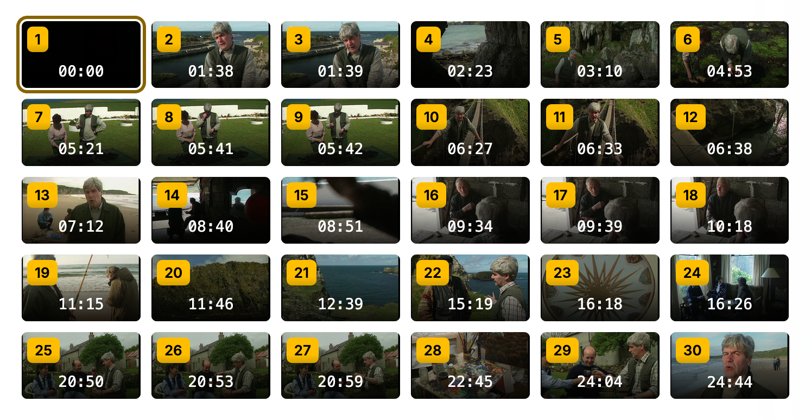
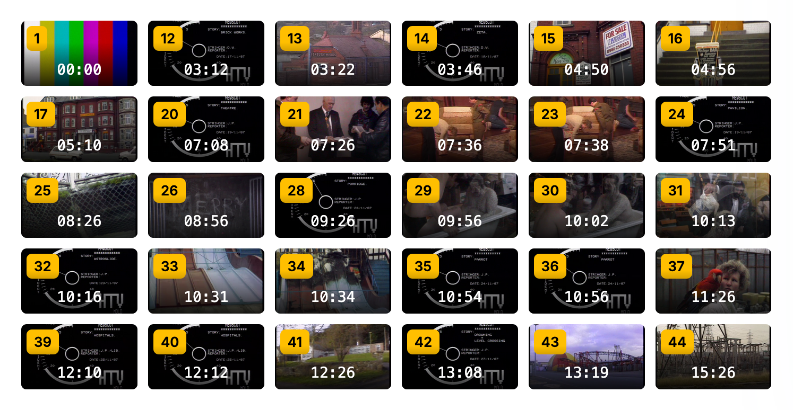

<style>
@import url('https://fonts.googleapis.com/css2?family=Outfit:wght@400;500;600&display=swap');

:root {
  --slidev-theme-primary: #0a2d50;
}

p, li, blockquote, td, th {
  font-family: Outfit, sans-serif;
}
</style>

<div style="position: absolute; top: 1.5rem; right: 2rem;">
  
</div>

<style scoped>
* {
  text-shadow: 2px 2px 8px rgba(0,0,0,0.8);
}
</style>

# Semantic Video Segmentation

### King's Digital Lab

#### Miguel Vieira

<br />

##### ISSA Demonstrator Programme · 2026

<!--
Hi, I'm Miguel, Principal Research Software Engineer at King's Digital Lab. I'm going to walk you through the video segmentation prototype we've built as part of ISSA.

The prototype is a pipeline that takes archive broadcast video and automatically identifies where content changes, producing structured metadata for each segment. I'll show you what it produces, how it works, and be clear about what we don't yet know. That last part is where your expertise comes in.
-->

---

# The Problem

Heritage 2022 digitised thousands of at-risk tapes. Many arrived without metadata.

- Is this one broadcast or several?
- What topics are covered?
- Where do segments begin and end?

Manual cataloguing at this scale isn't feasible. We need a way to generate a first pass automatically.

<!--
The starting point is a problem you'll recognise. Heritage 2022 produced a large volume of digitised material, but digitisation doesn't automatically produce description. Many of these tapes arrived as opaque files — we don't know if a single file contains one programme or ten, what topics are covered, or where one thing ends and another begins.

The only way to answer those questions reliably would be to watch the footage. That doesn't scale. So the question we set out to answer is: can we use AI to produce a useful first pass, automatically, using consumer hardware?
-->

---

# Our Approach

A pipeline for semantic segmentation that combines what's visible with what's said, then uses a language model to find boundaries.

- Extract frames and generate visual descriptions
- Transcribe the audio
- Pass both to a language model to identify where content changes
- Output structured metadata for each segment

We chose small, open-weight models because recent generations are capable enough for this task without requiring cloud infrastructure. The pipeline runs on institutional hardware and doesn't send data to third-party services — though it also supports OpenAI-compatible endpoints for institutions that prefer that route.

<!--
The approach is fairly straightforward. We sample frames from the video and generate plain-language descriptions of what's visible in each one. We also transcribe the audio. We then pass both streams — visual and audio — to a language model and ask it to identify where content meaningfully changes. That combination of visual and audio is what makes this semantic rather than purely structural — we're looking for topic and content shifts, not just technical transitions.

A key design decision was to use small, open-weight models rather than large commercial APIs. Models like Moondream, Whisper, and Gemma have become genuinely capable in the last couple of years, and they can run on hardware that institutions already own. That means no data leaves the building, no ongoing API costs, and no dependency on a third-party service staying available. That said, the pipeline does support OpenAI-compatible endpoints, so it's not an either-or choice.
-->

---

# The Output

For each segment, the pipeline produces:

- Start and end timestamps
- A plain-language summary of what's in the segment
- A topic label
- Programme name and channel where visible
- Transmission date where visible

**Example — Segment 11 · 07:38 → 08:12**

_"Live interview with a reporter discussing a court judgment on the RHI scheme. The department will contact individuals seeking anonymity before publishing details."_

Topic: television interview · Programme: uLIVE

<!--
The output for each segment is a structured JSON record, but what matters is what's in it. You get timestamps, a plain-language summary of what's happening in the segment, a topic label, and where the model can read it from the footage, programme name, channel, and transmission date.

This example is segment 11 from our test tape — a 34-second live interview clip about the RHI scandal. The summary is readable, the topic label is reasonable, and the programme name was correctly picked up from the on-screen graphics. Not every segment is this clean, which I'll come to shortly.
-->

---

# What It Found

**Test case:** 35-minute UTV news broadcast, contents unknown before processing.

**64 segments identified, including:**

- RHI scandal legal coverage
- East Belfast redevelopment story
- NI election and politics
- Life-saving postman feature story
- Air ambulance funding
- Cycle of Hope Rwanda documentary insert
- Rory McIlroy and Trump golf controversy
- Ulster rugby and Irish Cup football
- Weather forecast
- Programme sign-off and credits

The range of content types in a single tape illustrates both the challenge and what the pipeline is designed to handle.

<!--
For the demonstration I used a 35-minute UTV news broadcast. I had a rough sense of the contents from watching it, but the segmentation itself was done blind by the pipeline. What struck me when I looked through the results was how much it had picked up — in half an hour of broadcast you have legal reporting, a human interest story, politics, sport, weather, a charity documentary insert, and a sign-off sequence. All of that is now labelled and timestamped.

That variety is actually a good stress test. A pipeline that only handles one content type isn't much use for archive material, which tends to be messy and mixed. I'll show you the interface we built to explore these results.
-->

---

```yaml
layout: cover
background: ./assets/demo.png
```

<style scoped>
* {
  text-shadow: 2px 2px 8px rgba(0,0,0,0.8);
}
</style>

# Demo

<!--
_Start with the interface already open, video and output loaded, paused at 00:00. Both panels visible._

This is the verification interface with data already loaded. On the left, the video. On the right, the list of segments the pipeline identified — 64 in total for this 35-minute broadcast.

_Press play. Let it run for 3-4 seconds, just enough to see the segment highlight update._

As the video plays, the active segment updates automatically.

_Pause. Click the timestamp on segment 11 — 07:38._

I can jump to any segment directly by clicking its timestamp. This is segment 11 — a live interview about the RHI scheme ruling. The card shows the start and end time, the frame at each end of the segment, and the summary the pipeline generated from the combined visual and audio content.

_Let it play for a few seconds so the interview is audible. Pause._

Below the summary you can see the metadata the model extracted — topic, programme name, channel. This one picked up the programme name correctly from the on-screen graphics. That's not always the case, which is something we'll come back to.

_Scroll down the segment list to segments 4, 5, and 6._

This is also a good place to show a current limitation. Segments 5 and 6 are one and five seconds long respectively. The model is reacting to a brief visual change rather than a meaningful content boundary — it's splitting a scene it shouldn't. This is a known issue we'll be looking to address.

_Switch to the Frames view._

Switching to the frames view gives you an overview of all 64 segments at once. Each thumbnail shows the first frame of that segment.

_Slowly scroll or pan across the grid._

You can already see the variety — studio shots, on-location reporting, weather maps, sport.

_Click thumbnail for segment 39 — 25:23, the Rory McIlroy segment._

Clicking any thumbnail jumps to that point in the video and brings up the segment detail.

_Switch back to video view. Pause._

_Scroll down below the video and segment panels._

The interface also shows the full processing metadata — every step in the pipeline, how long each one took, and which model was used. Frame captioning dominates, which is where most of the computational work happens. This is logged automatically with every run, including the model and code version, so the output is reproducible.

_Pause briefly on the metadata section._

The interface runs entirely from local files — no server, no internet connection required. You load the video and the pipeline output folder
-->

---

```yaml
layout: two-cols-header
```

# Other Tests

::left::

**Documentary**

30 min · 30 segments



::right::

**Rushes with sound**

23 min · 44 segments · multiple locations · no voiceover



<!--
I've also run the pipeline on two other content types, which I won't demo but are worth mentioning.

A 30-minute documentary produced 30 segments with very few of the short boundary errors we saw in the news broadcast. The content divisions made sense when I looked through them.

The second was 23 minutes of rushes — multiple locations, sound but no voiceover — which produced 44 segments. The segments made sense overall, but encoding artifacts in some of the separators caused the model to split within the same transition rather than treating it as a single boundary.

Together these give a sense of how the pipeline behaves across different content types — and where it struggles.
-->

---

# What We Observe

<br />

**It handles variety well** — across three different content types, the pipeline identifies meaningful content shifts and produces useful summaries.

**Processing time is reasonable** — 87 minutes to process a 35-minute tape on a local GPU.

**Some boundaries are very short** — several segments are 1–5 seconds long. Some are real transitions — a slate, a cutaway — others are the model splitting a continuous scene unnecessarily.

**Metadata extraction is inconsistent** — programme name and channel appear correctly in some segments and as noise in others.

**We had no ground truth** — we can see what the pipeline produces, but we can't yet say whether the boundaries are correct, or whether 64 is the right number for this tape.

<!--
So what can we claim at this point.

On the positive side, across three different content types — a news broadcast, a documentary, and rushes — the pipeline handles a wide variety of content without falling over, and the summaries are readable and informative. Processing 35 minutes of video in 87 minutes on a local GPU is a reasonable trade-off for the kind of batch processing this would typically be used for.

The model does split scenes it shouldn't — there are segments of one or two seconds that represent the model reacting to a brief visual change rather than a meaningful content boundary. This is a known issue we'll be looking to address, either by tweaking the model prompts or via post-processing to merge short segments with their neighbours.

Metadata extraction is also inconsistent. The model sometimes correctly reads programme names from on-screen graphics and sometimes produces noise. And the fundamental issue is that we had no ground truth to measure against. We can describe the output but we couldn't evaluate it. We now have access to videos with existing metadata, which will let us run a proper evaluation and start putting numbers on accuracy.
-->

---

# The Precision Question

Accuracy requirements depend entirely on the use case.

- **Triage and discovery** — finding all segments roughly about a topic. Approximate boundaries are probably fine.
- **Cataloguing assistance** — generating draft descriptions for an archivist to review and correct. Some errors are acceptable.
- **Research access** — pointing a researcher to a specific moment. Precision starts to matter.
- **Rights or compliance decisions** — exact boundaries required. Human verification essential regardless.

We don't know which of these matters most to you, or whether the pipeline is anywhere near accurate enough for your specific needs. That's what we want to find out.

<!--
The question of whether the pipeline is good enough isn't one we can answer from the inside — it depends entirely on what you're trying to do with it.

For rough triage, finding everything that's broadly about a topic, approximate boundaries might be completely fine. For generating draft catalogue descriptions that a human will review anyway, some errors are tolerable. But if you need to point a researcher to a precise moment, or make rights or access decisions based on the output, the bar is much higher and human verification becomes essential regardless of how accurate the pipeline is.

We don't know where on that spectrum your most important use cases fall. That's the actual situation, and your answer will shape what we prioritise going forward.
-->

---

```yaml
layout: end
```

<style scoped>
h1 {
  color: white;
}

.slidev-layout {
  background-color: var(--slidev-theme-primary) !important;
}
</style>

# Feedback We Are Looking For

<br />

**Does the output make sense?**

**What does a segment mean in your context?**

**What level of accuracy is acceptable, and for what?**

**Help us define the typology for your content.**

<hr style="border-style: dashed; margin: 2rem auto; width: 50vw;" />

jose.m.vieira@kcl.ac.uk

<!--
So here's what we're actually asking for.

First, a reaction to the output — does what you've seen feel like useful segmentation, or does it miss the mark in ways that matter?

Second, a definition. We've been working with a fairly intuitive notion of what a segment is, but your domain knowledge may point to something more specific or different. That definition feeds directly into the instructions we give the model.

Third, a threshold. We'd rather hear something like "for digitisation triage we could work with 70% accuracy but for catalogue records we'd need 90%" than a general sense that it should be better. Concrete thresholds help us prioritise.

And fourth — typology. The pipeline's behaviour is significantly shaped by the instructions we give the language model, and the spec identifies prompt development as something to do collaboratively with partners. You know your content — what broadcast types you have, what their typical characteristics are, what a meaningful boundary looks like for news versus documentary versus raw footage. That knowledge, turned into prompt instructions, is likely to improve accuracy more than any technical change we could make. This is the most concrete way you can contribute to the development of the prototype.

Thank you — I'll be online for the Q&A and happy to go into any of this in more detail.
-->
