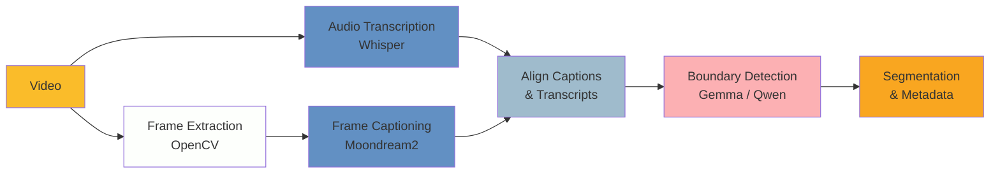

# Unlocking the Archive: Local-First Semantic Segmentation for Broadcast Video Heritage

A major European digitisation programme under Horizon 2020 recently preserved thousands of culturally significant films and videotapes at risk of loss. However, a significant challenge remains: many of these digital video files lack complete or reliable metadata about their contents. Archivists often cannot determine whether a file contains a single broadcast, a sequence of items, or a mixture—nor can they identify the topics covered within. Manual cataloguing at this scale is prohibitively time-consuming, leaving vast portions of audiovisual heritage effectively inaccessible.

This challenge is widespread. Moving image archives hold data-intensive collections but often lack the resources, infrastructure, and in-house expertise to computationally explore their holdings. Through consultation with multiple partner archives holding diverse collections, video segmentation was identified as a common use case with significant potential for AI assistance. This poster presents a tool developed in response to that need. It automatically identifies content boundaries, classifies segment types, extracts topics, and generates summaries, transforming opaque video files into structured, searchable data.

This work is situated within the emerging field of computational moving image studies, which brings together film and media scholarship with computational methods (Arnold & Tilton, 2023; Chávez Heras, 2024). It also engages critically with debates around machine vision and algorithmic seeing (Rettberg, 2023), acknowledging both the opportunities and limitations of AI in archival contexts.

## Methodology

Our approach combines three AI modalities:

1.  Visual Analysis: A vision-language model generates natural language descriptions of sampled frames, capturing visual cues such as studio settings, on-screen text, and presenter changes.
2.  Audio Transcription: A speech recognition model extracts timestamped speech, providing the narrative thread that often defines segment boundaries.
3.  LLM Reasoning: A language model analyses the visual and audio evidence using a sliding-window approach to detect semantic boundaries—distinguishing, for example, between a scene change within a news story and a transition to a commercial break.

The pipeline outputs time-coded segments with:

- Start and end timestamps
- Summary (free-text description of segment content)
- Topic (e.g., news broadcast, commercial)
- Channel and program name
- Transmission date

A key design principle is local-first processing. The default configuration runs entirely on consumer hardware using open-source models, ensuring that sensitive or rights-encumbered material never leaves the institution's infrastructure. The codebase is publicly available under an MIT licence, with documentation designed to support replication and adaptation by archives of different sizes and resources.

## Reproducibility and Transparency

Every output file includes comprehensive profiling metadata: model name, processing time, device, git commit hash, and software versions. This supports the reproducibility standards increasingly expected in digital humanities research and provides a clear provenance trail for derived metadata.

## Evaluation Interface

Recognising that AI-generated metadata requires human validation, we developed an offline verification dashboard. This tool displays the video alongside segment cards, auto-scrolling to the current segment as the video plays. Users can click any timestamp to jump to that position and assess accuracy. The tool requires no server and works entirely from the local filesystem, supporting air-gapped archive environments.

## Findings and Discussion

Initial testing shows that processing a 30-minute broadcast video on consumer GPU hardware takes approximately 80 minutes end-to-end. The sliding-window boundary detection significantly reduces over-segmentation compared to pairwise frame comparison. Quality varies by model: smaller local models produce more false positives than larger models, but remain viable for initial triage and cataloguing workflows.

These findings directly address the conference theme of "Engagement", particularly the sub-themes of Remembering and Annotating. The tool unlocks "dark data" in AV archives, enabling new forms of access to cultural memory. By working with small, local models and enabling nuanced human-in-the-loop validation, we demonstrate that meaningful semantic analysis is achievable without massive infrastructure, removing dependence on commercial cloud APIs, which is critical for smaller institutions, those with limited budgets, and archives handling sensitive material.

The poster will demonstrate the pipeline workflow, showcase the verification interface, and discuss lessons learned in balancing automation with archival accuracy.

## References

Arnold, T., & Tilton, L. (2023). Distant Viewing: Computational Exploration of Digital Images. MIT Press.

Chávez Heras, D. (2024). Cinema and Machine Vision: Artificial Intelligence, Aesthetics and Spectatorship. Edinburgh University Press.

Rettberg, J. W. (2023). Machine Vision: How Algorithms are Changing the Way We See the World. Polity Press.
