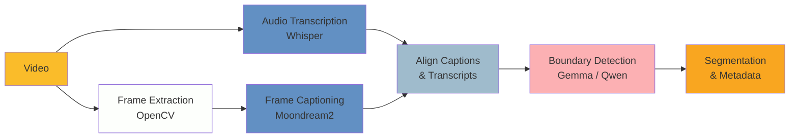

# Unlocking the Archive: Local-First Semantic Segmentation for Broadcast Video Heritage

A major European digitisation programme recently preserved thousands of culturally significant videotapes at risk of loss. Many of these files lack reliable metadata: archivists cannot determine whether a file contains a single broadcast or several, nor identify the topics covered. Manual cataloguing at this scale is prohibitively time-consuming, leaving vast portions of audiovisual heritage effectively inaccessible.

Through consultation with multiple partner archives, video segmentation was identified as a common need with significant potential for AI assistance. This poster presents a tool that automatically identifies content boundaries, classifies segment types, extracts topics, and generates summaries, transforming opaque video files into structured, searchable data. The codebase is publicly available under an MIT licence https://github.com/kingsdigitallab/issa/tree/main/prototypes/segment.

This work is situated within computational moving image studies (Arnold & Tilton, 2023; Chávez Heras, 2024) and engages with debates around machine vision (Rettberg, 2023). Unlike shot boundary detection tools that identify technical cuts, our approach targets _semantic_ boundaries, where one topic ends and another begins, using a zero-shot multimodal pipeline that requires no labelled training data and runs entirely on consumer hardware.

## Methodology

Our approach combines three AI modalities:

1.  Visual Analysis: Moondream2 (1.9B parameters, fits 8 GB VRAM) generates natural language descriptions of sampled frames, capturing visual cues such as studio settings, on-screen text, and presenter changes.
2.  Audio Transcription: OpenAI Whisper extracts timestamped speech, providing the narrative thread that often defines segment boundaries.
3.  LLM Reasoning: A language model analyses the aligned visual and audio evidence using a three-frame sliding window (previous, current, next) to detect semantic boundaries. The architecture is model-agnostic; we tested with Gemma-3-4B, while a partner institution used Qwen models.

The pipeline outputs time-coded segments with start and end timestamps, a free-text summary, topic label, and, where visible in the footage, channel, programme name, and transmission date.

The default configuration runs entirely on consumer hardware using open-weight models, ensuring sensitive material never leaves the institution's infrastructure. An optional API backend supports OpenAI-compatible endpoints for institutions that prefer cloud models.

## Reproducibility and Evaluation

Every output file includes profiling metadata (model name, processing time, device, git commit hash, and software versions), providing a clear provenance trail for derived metadata. An offline verification dashboard displays the video alongside segment cards for human-in-the-loop validation, requiring no server and supporting air-gapped environments.

## Findings and Discussion

We tested the pipeline on three content types: a 35-minute news broadcast (64 segments identified), a 30-minute documentary (30 segments), and 23 minutes of rushes (44 segments). Processing a 35-minute tape takes approximately 87 minutes on a consumer GPU, with frame captioning accounting for the majority of computation. The three-frame sliding window significantly reduces over-segmentation compared to pairwise frame comparison, though short spurious segments (1–5 seconds) remain a known limitation when the model reacts to brief visual changes rather than meaningful content shifts.

In a recent workshop, a partner institution independently processed 50 videos using the pipeline and adapted it to detect advertisements, demonstrating that the tool generalises beyond its original design context. Formal accuracy metrics are not yet available, as no ground truth existed for the test corpus. Now that labelled catalogue metadata has become available, we plan to evaluate boundary precision and recall with a temporal tolerance window, and to assess summary quality using semantic similarity scoring.

These findings address the conference theme of "Engagement", particularly Remembering and Annotating. The tool unlocks "dark data" in AV archives, demonstrating that meaningful semantic analysis is achievable on consumer hardware without cloud infrastructure, critical for institutions with limited budgets or handling sensitive material. The poster will demonstrate the pipeline workflow, showcase the verification interface, and discuss lessons learned in balancing automation with archival accuracy.

## References

Arnold, T., & Tilton, L. (2023). Distant Viewing: Computational Exploration of Digital Images. MIT Press.

Chávez Heras, D. (2024). Cinema and Machine Vision: Artificial Intelligence, Aesthetics and Spectatorship. Edinburgh University Press.

Rettberg, J. W. (2023). Machine Vision: How Algorithms are Changing the Way We See the World. Polity Press.
